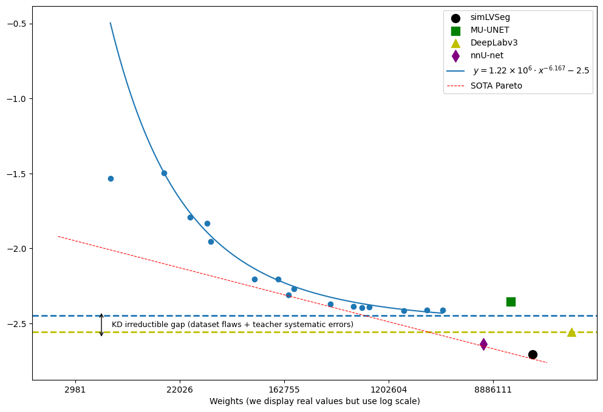

# EchoDFKD

EchoDFKD is in the proceedings of WACV2025, available [here](https://openaccess.thecvf.com/content/WACV2025/html/Petit_EchoDFKD_Data-Free_Knowledge_Distillation_for_Cardiac_Ultrasound_Segmentation_using_Synthetic_WACV_2025_paper.html).

## Overview

EchoDFKD is a framework to enable model training and evaluation using only interactions with other existing models, without the need for human labels or real data. 
The framework is based on the idea of data-free knowledge distillation, where a student model is trained to mimic the behavior of a teacher model on a synthetic dataset generated from another trained model.
The framework is designed to be general and can be applied to any domain where trained models are more easily available than labeled data used to train them. Here, we apply it to echocardiography for the task of left ventricle segmentation.

## Installation

### Prerequisites

Ensure you have the following installed:

- Python 3.6+
- PyTorch 1.10+
- OpenCV
- PyTorch Lightning
- NumPy
- Pandas

You can install all these packages using the provided `requirements.txt` file:

```bash
python3 -m venv ~/echodfk
source ~/echodfk/bin/activate
pip install -r requirements.txt
```

## Prepare models

You will need to download some teachers model weights.
In our experiment we use the trained model from the [EchoNet-Dynamic](https://echonet.github.io/dynamic/) project, which is available on the following link : https://github.com/douyang/EchoNetDynamic/releases/download/v1.0.0/deeplabv3_resnet50_random.pt .
Don't hesitate to try other teacher models.
Place weight files in models/your_teacher_name (for instance, models/echonet_deeplabV3).

## Prepare Your Datasets

You can download a synthetic dataset on https://huggingface.co/HReynaud (or you might want to generate your own synthetic dataset).
If you want to run the experiments that show the model's performance on the EchoNet-Dynamic dataset, you also need to download it from the [EchoNet-Dynamic](https://echonet.github.io/dynamic/) website. The dataset is available for free, but you need to request access. Recently, it was also available on a Kaggle link.


## Configure Paths and Hyperparameters

You might want to change the paths in the `settings.py` file to match your local setup. 
Regarding the directory containing the videos, you can simply set an environment variable with, for example, a command like `export VIDEO_DIR="/home/your_name/example_path/a4c-video-dir/Videos/"` and the code will automatically find the videos.

You can also change the hyperparameters in the `hyperparameters` directory.

## Run the pipeline

The pipeline follows these steps:

0. **Production of a synthetic dataset**
1. **Production of targets on synthetic dataset**
2. **Training of the student model**
3. **Inference**
4. **Model evaluation**
5. **Visuals**

You can run the pipeline by executing the following command:

```bash
python core/run_all.py
```
Or you can run each step separately if you prefer.

## Directory Structure

The repository is structured as follows:

```https://openaccess.thecvf.com/content/WACV2025/html/Petit_EchoDFKD_Data-Free_Knowledge_Distillation_for_Cardiac_Ultrasound_Segmentation_using_Synthetic_WACV_2025_paper.html
EchoDFKD/
│
├── a4c-video-dir/             # Directory containing video files and related data
│   ├── FileList.csv           # contains volumes & EF, and train/val/test split for real data
│   ├── synthetic_FileList.csv # contains volumes & EF, and train/val/test split for synthetic data
│   ├── Videos/                # Dir containing real clips in AVI format (converted from DICOM)
│   ├── Videos_synthetic/      # Dir containing synthetic AVI videos
│   └── VolumeTracings.csv     # File from EchoNet-Dynamic containing human labels
│
├── ConvLSTM_Segmentation/     # Subrepo containing the student model architecture
│   └── ...
│
├── core/                               # Whole pipeline
│   ├── produce_targets.py              # Produces targets for synthetic dataset (first step)
│   └── train.py                        # Trains the student model (second step)
│   └── inference.py                    # Performs inference on the test dataset (third step)
│   └── evaluate_LVEF.py                # Evaluates the student model on the test set (fourth step, part 1)
│   └── evaluate_DICE.py                # Evaluates the student model on the test set (fourth step, part 2)
│   └── evaluate_aFD.py                 # Evaluates the student model on the test set (fourth step, part 3)
│   └── create_visuals.py               # Creates visuals for the student model (fifth step)
│   └.. (create_synthetic_dataset.py ?) # WIP, would be step 0
│
├── data/                               # Will store large intermediate files
│   └── ...
│
├── echoclip/                           # Echoclip related data/feature files
│   └── ...
│
├── echonet_a4c_example.py              # define the important class Example, representing a clip
│
├── echonet_deeplab_dir/
│   └── size.csv                        # ED&ES labelled frames no. for each video
│
├── examples_and_vizualisation/ 
│   ├── Study_labels.ipynb              # Visualize labels produced by humans
│   └── Study_EchoCLIP_outputs.ipynb    # Visualize EchoCLIP-based phase inference
│
├── hyperparameters/                    # Hyperparameter configurations
│   └── ...
│
├── models/                             # Directory for storing model weights and hyperparams
│   └── ...
│
├── Output/                             # Directory for model outputs
│   └── ...
│
└── settings.py                         # Constants, paths, settings
```
## Results on the LV segmentation task

Here is an improved version of the figure from the paper showing the DICE scores of our models. 
Following recent works, we use a more subtle model than a linear one to fit the experimental curve, that better captures the saturation phenomenon when the dataset size becomes limiting.


